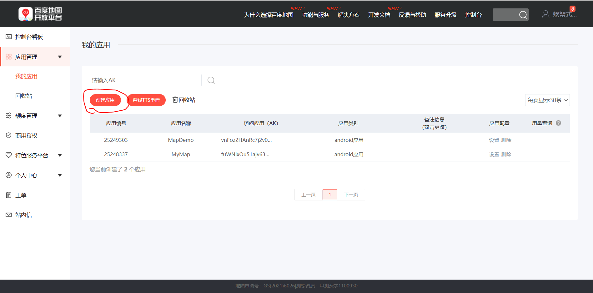
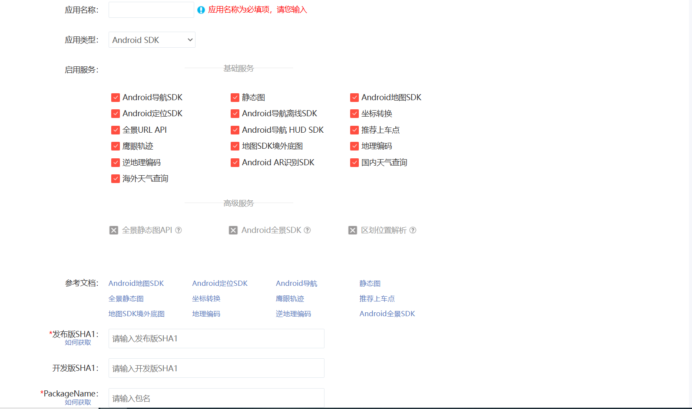
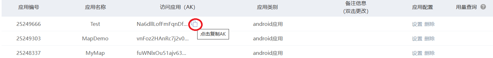
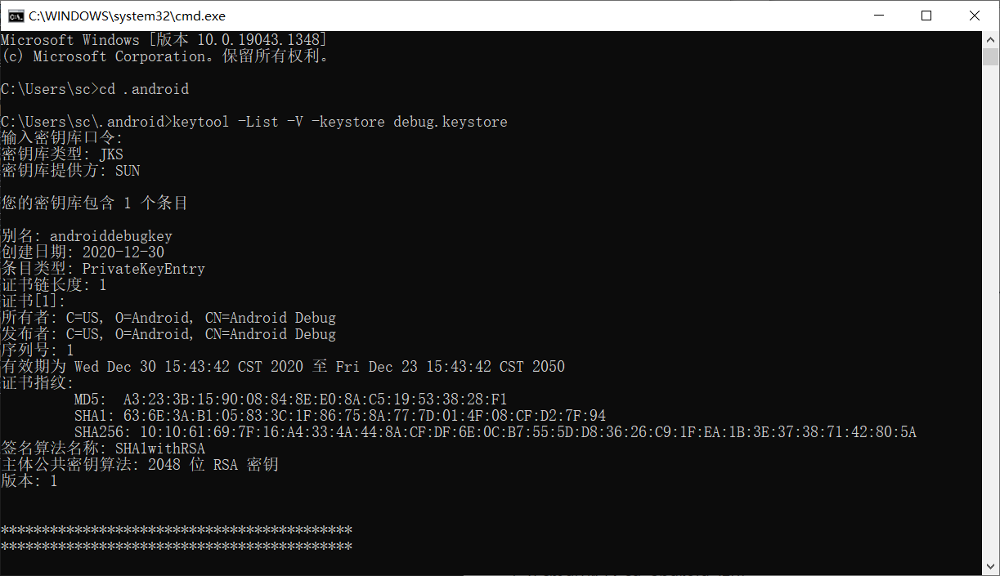
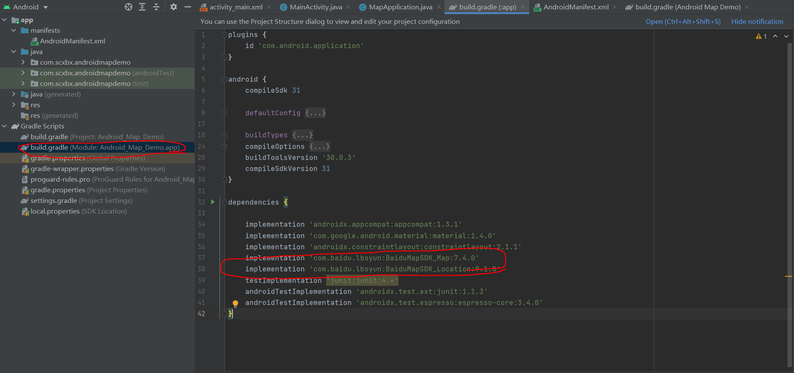
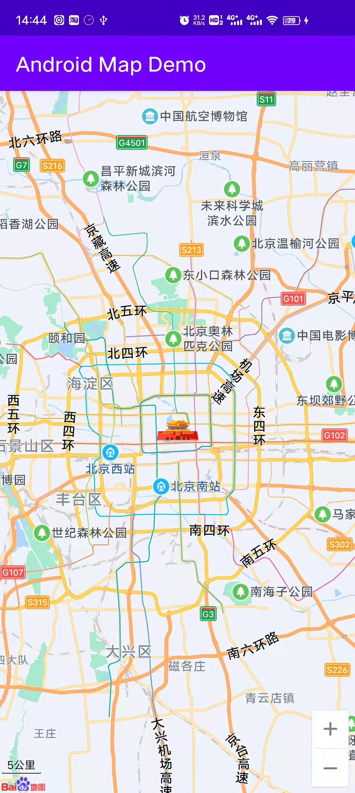

# Baidu Map Application Demo

#### 一、获取百度地图API KEY

[Android地图SDK | 百度地图API SDK (baidu.com)](https://lbsyun.baidu.com/index.php?title=androidsdk)

打开上面的链接，点击获取密钥


登录后，进入如下界面



点击创建应用，进入如下界面



1. 填写应用名称
2. 应用类型选为Android SDK
3. 填入发布版SHA1
4. 填入PackageName
5. 点击提交，进入下个页面



点此处来复制api key


#### 二、如何获取SHA1和PackageName

1. 按win+r，打开运行；输入cmd，敲回车，即可打开cmd

2. 在cmd中输入cd .android, 回车

3. 输入keytool -List -V -keystore debug.keystore，回车

4. 输入密码，默认为android

5. 可以看到SHA1，如图

   


6. 在AndroidManifest.xml里，前几行就能找到packagename


#### 四、添加依赖

在build.gradle中，dependenceis里，加入

```
implementation 'com.baidu.lbsyun:BaiduMapSDK_Map:7.4.0'
implementation 'com.baidu.lbsyun:BaiduMapSDK_Location:9.1.8'
```



##### 出现以下提示，点击 Sync now


#### 五、加入代码

##### 1. 创建MapApplication.java

```java
public class MapApplication extends Application {
    @Override
    public void onCreate() {
        super.onCreate();
        SDKInitializer.setCoordType(CoordType.BD09LL);
        SDKInitializer.initialize(this);
    }
}
```

##### 2. 在activity_main.xml里，删除默认的TextView, 插入以下代码

```xml
<com.baidu.mapapi.map.MapView
    android:layout_width="match_parent"
    android:layout_height="match_parent"
    android:id="@+id/bmapView"
    android:clickable="true"/>
```

##### 3. 在MainActivity.xml里，写入以下代码

```java
public class MainActivity extends AppCompatActivity {
    private MapView mapView = null;


    @Override
    protected void onCreate(Bundle savedInstanceState) {
        super.onCreate(savedInstanceState);
        setContentView(R.layout.activity_main);

        mapView = findViewById(R.id.bmapView);

    }

    @Override
    protected void onResume() {
        super.onResume();
        mapView.onResume();
    }

    @Override
    protected void onPause() {
        super.onPause();
        mapView.onPause();
    }

    @Override
    protected void onDestroy() {
        super.onDestroy();
        mapView.onDestroy();
    }
}
```


##### 5. 在AndroidManifest.xml里，替换为以下代码。

```xml
<?xml version="1.0" encoding="utf-8"?>
<manifest xmlns:android="http://schemas.android.com/apk/res/android"
    package="com.scxbx.androidmapdemo">

    <uses-permission android:name="android.permission.INTERNET"/>
    <uses-permission android:name="android.permission.ACCESS_NETWORK_STATE"/>
    <uses-permission android:name="android.permission.READ_EXTERNAL_STORAGE" />
    <uses-permission android:name="android.permission.WRITE_EXTERNAL_STORAGE"/>

    <application
        android:name=".MapApplication"	
        android:allowBackup="true"
        android:icon="@mipmap/ic_launcher"
        android:label="@string/app_name"
        android:roundIcon="@mipmap/ic_launcher_round"
        android:supportsRtl="true"
        android:theme="@style/Theme.AndroidMapDemo">
        
        <meta-data android:name="com.baidu.lbsapi.API_KEY"
            android:value="vnFoz2HAnRc7j2v0IzLf8CGwBNpTLFQm" />

        <activity
            android:name=".MainActivity"
            android:exported="true">
            <intent-filter>
                <action android:name="android.intent.action.MAIN" />

                <category android:name="android.intent.category.LAUNCHER" />
            </intent-filter>
        </activity>
    </application>

</manifest>
```

注意下面三处代码

```xml
<uses-permission android:name="android.permission.INTERNET"/>
<uses-permission android:name="android.permission.ACCESS_NETWORK_STATE"/>
<uses-permission android:name="android.permission.READ_EXTERNAL_STORAGE" />
<uses-permission android:name="android.permission.WRITE_EXTERNAL_STORAGE"/>
```

```xml
android:name=".MapApplication"
```

```xml
<meta-data android:name="com.baidu.lbsapi.API_KEY"
    android:value="vnFoz2HAnRc7j2v0IzLf8CGwBNpTLFQm" />
```


#### 六、运行

效果如下图

